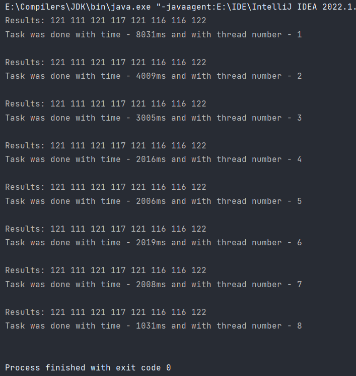

# My custom ThreadPoolExecutor

The main thread monitors if the executor's max thread number is exceeded.

If it is, the main thread waits a thread to terminate and creates a new thread.

Original Java ThreadPoolExecutor throws exception in this case.

